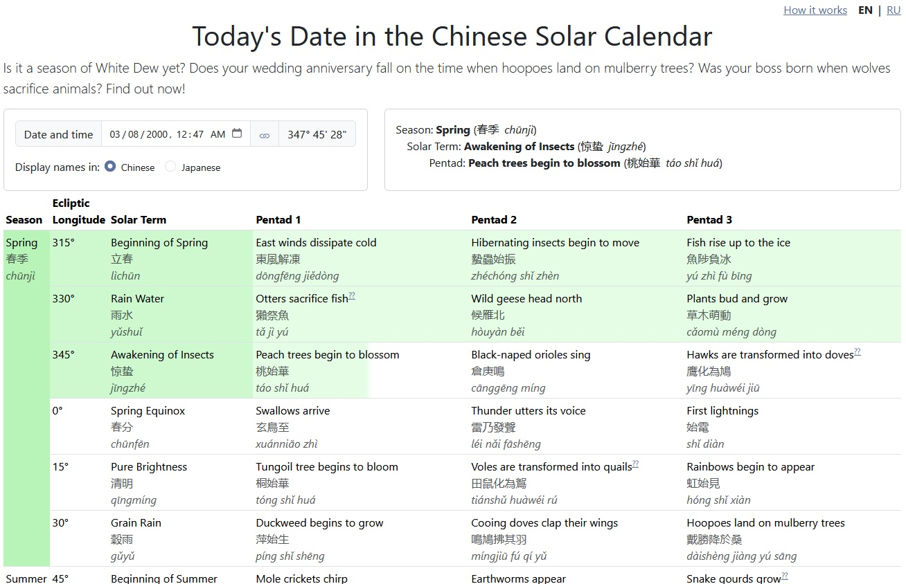

# Risshun

This tool determines the solar ecliptic longitude based on the selected date and time, then displays the corresponding season, solar term, and pentad according to the traditional Chinese solar calendar. Pentads that have already passed are shown in green. Japanese pentad names are also provided. Written in Angular v. 19.2.10.

## Dependencies
* [Bootstrap](https://getbootstrap.com/) 5.3.3
* [Decimal.js](https://mikemcl.github.io/decimal.js/) 10.5.0
* [Transloco](https://jsverse.gitbook.io/transloco/) 7.6.1

## Screenshot

## Tests

Unit tests are standard Angular Karma and Jasmine tests that can be run by using `ng test`.
